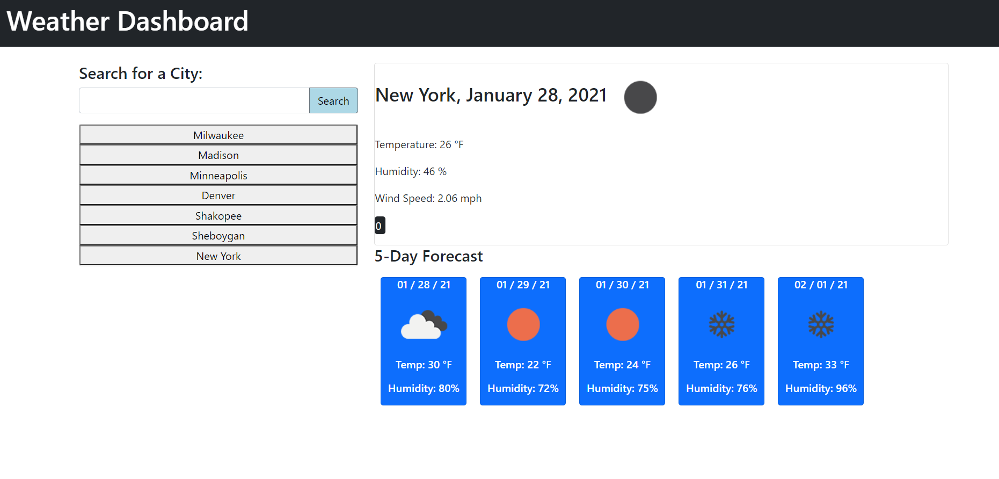

Weather-Dashboard

# Description

When the user enters a city, the weather and 5-day forecast will appear.

# Technologies Used

HTML5, CSS3, Bootstrap3, JavaScript, jQuery, Openweather API, AJAX, local storage

# Screenshots

# Links

## Webpage URL

https://bryan-thaoxaochay.github.io/HW-6-Weather-Dashboard/

## Github Repo
https://github.com/Bryan-Thaoxaochay/HW-6-Weather-Dashboard 

# What I Learned

## List
1. Double API Calls
    Since ajax calls are asynchronous, I had to use a different code then .then after an ajax call. Instead, I used .done which means the first ajax call is completed before the second ajax call is used. 

2. Practice with APIs
    I got some much needed practice with getting APIs into JS, getting the API key, and traversing APIs with the parameters.

3. Creating and adjusting cards
    I learned how to create and adjust cards in bootstrap.

4. Using moment.js and UNIX timestamps
    The UNIX timestamp given to me from the API was giving me all kinds of trouble. First off, I didn't even know it was a UNIX timestamp. Something really important, because I had the syntax of moment correct, but I was missing the * 1000 part.

5. break()
    I for looped to create the cards of the 5-day forecast, but it was an 8-day forecast instead! Then I learned that break() can stop a for loop by simply stating: if i > 4, stop the for loop.

6. event.target
    I was having issues with the search history buttons and displaying the weather info. With help, the click function targeted an event and got back the text instead of getting the text from the element id. 

7. Multiple CSS adjustments in JS
    After all the hard work, I learned that we can make multiple CSS edits through this syntax: .css({"": "", "":""});

# Contact Information

Email: bthaoxaochay@gmail.com
GitHub: https://github.com/Bryan-Thaoxaochay 
